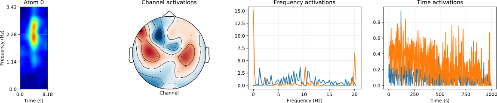

# T-ConvFISTA algorithm

Code of the T-ConvFISTA (TC-FISTA) algorithm used in "Tensor Convolutional Sparse Coding with Low-Rank activations, an application to EEG analysis" [[link]](https://arxiv.org/abs/2007.02534). In addition, we provide a pretrained model on the Electroencephalogram signals (EEG) of the paper.

## Container

##### -- Notebooks --
The reposity contains the code of TC-FISTA and three notebooks:

1) One for synthetic data
2) One to visualize the pretrained model of the EEG application of the paper
3) One to empirically check the validity of the different proofs in the paper

##### -- Data --
The folder 'data' contains all nescessary files to visualize results on EEG:

One example of atom with its activations



## Requirements

This code runs on Python >= 3.5. Set up environment with:
```
pip install -r requirements.txt
```
